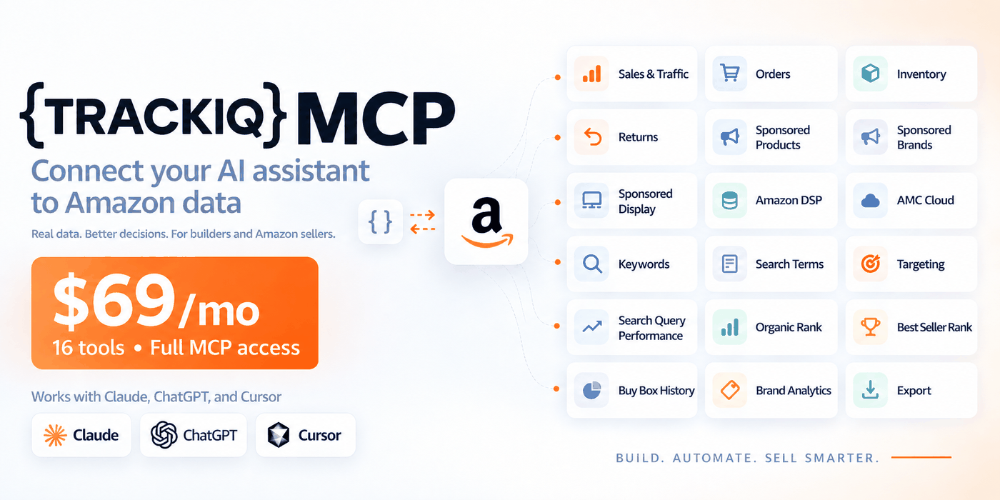
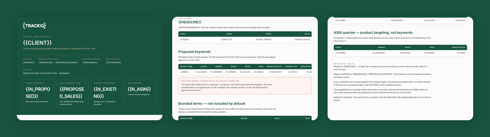

# TrackIQ: Amazon Search-Term Harvester

The mirror of the Wasted-Spend Sweeper. That one cuts what is not paying; this one **promotes what already is.**

A search term converting above break-even inside an auto or broad campaign is being bought at whatever bid the match type happens to produce. Given its own exact-match keyword it can be bid deliberately.

Part of **Amazon Sponsored Ads** in the
[TrackIQ skills catalog](https://github.com/TrackIQ-HQ/amazon-seller-skills).

Built as an [Agent Skill](https://code.claude.com/docs/en/skills). Runs in
Claude Code, Claude web, Claude desktop and ChatGPT from the same folder.

---

## Powered by the TrackIQ MCP

[](https://trackiq.com/mcp)

This skill reads your live Amazon account through the
**[TrackIQ MCP](https://trackiq.com/mcp)** — 16 tools connecting your AI
assistant to Amazon data:

Sales & Traffic · Orders · Inventory · Returns · Sponsored Products · Sponsored
Brands · Sponsored Display · Amazon DSP · AMC Cloud · Keywords · Search Terms ·
Targeting · Search Query Performance · Organic Rank · Best Seller Rank · Buy Box
History · Brand Analytics · Export

Works with Claude, ChatGPT and Cursor. **[Get access →](https://trackiq.com/mcp)**

---

## What you get



Finds the Amazon search terms that already convert above break-even but have no keyword of their own, and turns them into an upload-ready Sponsored Products bulk file with exact-match keywords and suggested bids. Checks every candidate against the existing targets so nothing is proposed twice. Use when the user asks about harvesting search terms, promoting search terms to keywords, mining auto campaigns, converting search terms, keyword expansion, what should we add as exact match, or finding new keywords from the search term report.

### The rules that keep it honest

- **`get_search_terms` has no campaign_id and no ad_group_id**
- **Dedupe against `get_targets` before proposing anything**
- **Promote on orders, not on clicks**
- **Break-even is the bar, not ROAS above 1**

The full list is in `SKILL.md`, and each one exists because getting it wrong
produces a confident, wrong answer rather than an obvious error.

## Requirements

- The TrackIQ MCP, for `list_marketplaces`, `get_search_terms`, `get_targets` and `get_ad_groups`. - **A break-even ROAS** — ask for it. Gross margin divided into 1. Without it the report cannot say which terms are worth promoting, only which convert. Default 2.0x, labelled an assumption. - **A destination ad group.** The search-term data carries no campaign or ad group, so nothing can be routed automatically. See non-negotiable 1. - Nothing else. No filesystem, no shell, no internet. `assets/build_bulk.py` writes the workbook if a shell is available; the format is in `assets/bulk-format.md` either way. - **Without the MCP:** works from a Search Term Report export plus a keyword export for the dedupe.

---

## Install

### Claude Code

```
/plugin marketplace add TrackIQ-HQ/amazon-seller-skills
/plugin install trackiq-amazon-search-term-harvester@trackiq
```

### Claude web, desktop, mobile

1. Download the `.zip` from the
   [latest release](https://github.com/TrackIQ-HQ/trackiq-amazon-search-term-harvester/releases)
2. **Settings → Capabilities → Skills** (code execution must be on)
3. **Create skill → Upload a skill**, choose the `.zip`
4. Toggle it on

### ChatGPT

Same zip. **Plugins → Skills → Create → Upload from your computer.**

---

## Setup

Answers live in `account.md`, copied from
[`assets/account.example.md`](skills/trackiq-amazon-search-term-harvester/assets/account.example.md).
**Every TrackIQ skill reads the same file**, so an account already set up for
another TrackIQ report needs nothing added.

## Delivery

Asked once and stored in `account.md`: **in-chat** (default), **file**,
**Slack**, **n8n** or **email**. Anything leaving the chat confirms with you
first and falls back to in-chat, with a note.

---

## Customizing

| File | What it controls |
|---|---|
| `build_bulk.py` | the bundled script |
| `bulk-format.md` | reference detail |
| `checks.md` | the pre-send checks |
| `method.md` | the method and every threshold |
| `pulls.md` | the call sequence and its traps |
| `report-template.html` | the report shell |

---

## Contributing

```bash
python scripts/validate.py    # must exit 0 before any commit
python scripts/build.py       # writes dist/ zip + registry.json
```

Read [AUTHORING.md](https://github.com/TrackIQ-HQ/amazon-seller-skills/blob/main/AUTHORING.md)
before proposing changes.

## License

MIT. See [LICENSE](LICENSE).
